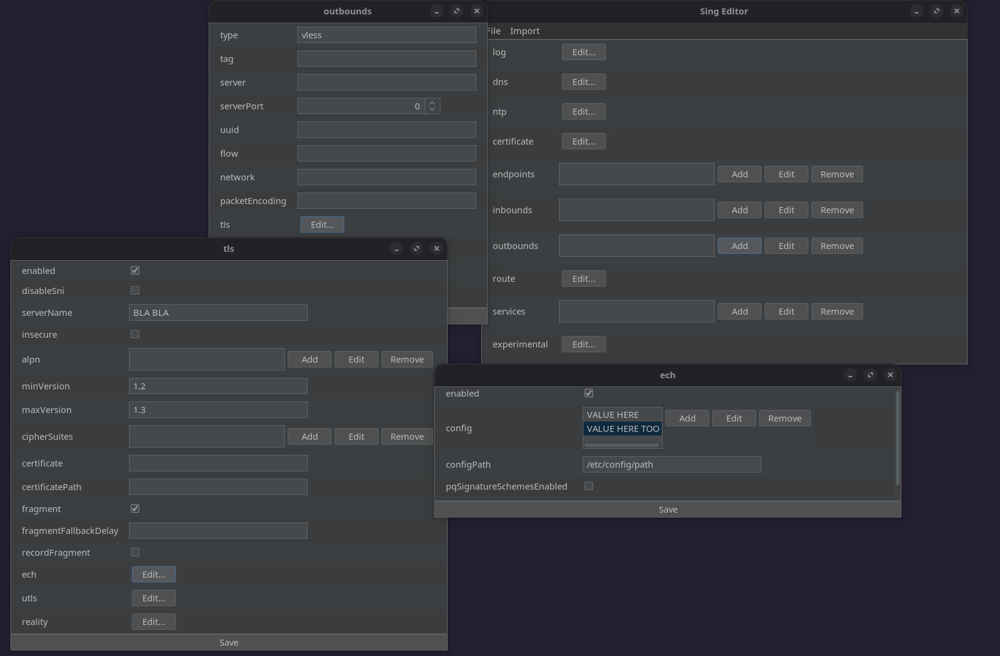

# SingEditor

SingEditor is a graphical configuration editor for [sing-box](https://github.com/SagerNet/sing-box), built with Java and Swing. It provides a graphical user interface (GUI) to view, edit, and save JSON configuration files without manual JSON editing.

**⚠️ Alpha Stage:** This project is under active development. Bugs may exist and features are not fully implemented.

<!-- Screenshot of the application UI -->


*Note: No time was spent on UI design, so it may look a bit strange.*

## Why SingEditor?

Sing-box configuration files can become complex with nested objects, lists, and various protocol settings, and until now no GUI editor has offered a comprehensive solution.
SingEditor fills this gap by offering:

- Automatically generating form fields for any Java config model using reflection
- Intuitive editing of inbound and outbound settings
- Preventing user errors by providing predefined GUI fields based on the model classes; users only need to fill in valid data

## Requirements

- Java 17 or newer

## Build

```bash
./gradlew clean build
```

Output JAR: `build/libs/SingEditor-1.0-SNAPSHOT.jar`

## Run GUI

```bash
java -cp build/libs/SingEditor-1.0-SNAPSHOT.jar com.kweezy.singeditor.MainGui
```
